# Machine Learning project

## Data Selection and background
It has long been observed that the relationship between the frequency and the magnitude of seismic events in a given region follows the power law. In other words, when observing earthquake occurrences over time we expect the earthquakes of small magnitude to be much more frequent than the earthquakes of large magnitude. Following the study of California earthquakes by Gutenberg B and Richter C.F, this relationship is named the Gutenberg-Richter inverse power law and it is defined mathematically as follows:  
                              

The data set for this project was taken from the catalog of [USGS (United States Geological Survey) website](https://earthquake.usgs.gov/earthquakes/search/). The data contains regional (see Figure 1) recorded seismic network information such as earthquake location, magnitude, date, depth, and more (total of 23 variables and 4071 observations).  

 

## Characterization of the problem

The objective of this project is **to Predict the Maximum Earthquake Magnitude of next year**. This kind of prediction is based on a research article published on 2016 ([Last et al](http://journals.plos.org/plosone/article?id=10.1371/journal.pone.0146101)). All the formulas and synthesized features are based on this article.
The Prediction of this project is a binary classification task based on the median of maximum yearly magnitudes (threshold value). Possible models that were applied in this task are Decision Tree, K-Nearest Neighbor (KNN), Support vector machine (SVM), and Neural Network (NNET).
The next sections are written in accordance to the CRISP-DM data science life cycle.


## Data Understanding

AS mentioned above, the raw data consists of 23 variables and 4071 observations:  

```
## 'data.frame':	4071 obs. of  22 variables:
##  $ time           : Factor w/ 4071 levels "1918-09-29T12:07:14.000Z",..: 1 2 3 4 5 6 7 8 9 10 ...
##  $ latitude       : num  35.1 36 31.9 32.4 36.5 ...
##  $ longitude      : num  35.6 29.5 35.6 33.5 35.9 ...
##  $ depth          : num  15 15 15 15 15 15 15 15 15 20 ...
##  $ mag            : num  6.6 6.8 6.3 5.9 5.8 5.2 5.3 5.7 5.5 6.3 ...
##  $ magType        : Factor w/ 10 levels "m","mb","md",..: 6 6 6 6 6 6 6 6 6 6 ...
##  $ nst            : int  NA NA NA NA NA NA NA NA NA NA ...
##  $ gap            : num  NA NA NA NA NA NA NA NA NA NA ...
##  $ dmin           : num  NA NA NA NA NA NA NA NA NA NA ...
##  $ rms            : num  NA NA NA NA NA NA NA NA NA NA ...
##  $ net            : Factor w/ 3 levels "iscgem","iscgemsup",..: 1 1 1 1 1 2 2 1 1 1 ...
##  $ id             : Factor w/ 4071 levels "iscgem17290377",..: 21 20 19 17 18 26 27 16 14 15 ...
##  $ updated        : Factor w/ 4049 levels "2013-11-15T03:20:29.000Z",..: 3886 3887 3887 3888 3888 3907 3907 3889 3890 3890 ...
##  $ place          : Factor w/ 170 levels "0km N of Ypsonas, Cyprus",..: 163 170 155 157 153 156 170 153 168 154 ...
##  $ type           : Factor w/ 2 levels "earthquake","explosion": 1 1 1 1 1 1 1 1 1 1 ...
##  $ horizontalError: num  NA NA NA NA NA NA NA NA NA NA ...
##  $ depthError     : num  NA NA NA NA NA NA NA NA NA NA ...
##  $ magError       : num  NA NA NA NA NA NA NA NA NA NA ...
##  $ magNst         : int  NA NA NA NA NA NA NA NA NA NA ...
##  $ status         : Factor w/ 2 levels "automatic","reviewed": 1 1 1 1 1 1 1 1 1 1 ...
##  $ locationSource : Factor w/ 14 levels "ath","bhl","csem",..: 8 8 8 8 8 8 8 8 8 8 ...
##  $ magSource      : Factor w/ 16 levels "ath","bhl","csem",..: 10 10 10 10 10 10 10 10 10 10 ...
```

For the purposes of this project and for preserving the basic information of each earthquake event (observation), only 6 variables were extracted from the raw dataset:  

* Date- Date of earthquake event (extracted from the Time variable).  
* Latitude and Longitude (two seperate variables)- Location of an earthquake event.  
* Depth- Depth to earthquake origin location (from surface).  
* Magnitude(mag)- Richter magnitude scale of an earthquake event.  
* Magnitude type(magType)- The method or algorithm used to calculate the preferred magnitude for the event.  

Before further investigating the data, there is a need to filter out all foreshock and aftershock events. To obtain that, all recorded events from the same date were combined by the maximum magnitude value of that day. It is important to mention that this kind of filter is definitely not enough to include only mainshocks but for this project educational purpose it is okay.  


```
##       Date               latitude       longitude         depth       
##  Min.   :1918-09-29   Min.   :26.55   Min.   :27.77   Min.   :  0.00  
##  1st Qu.:1993-11-04   1st Qu.:34.55   1st Qu.:28.92   1st Qu.: 10.00  
##  Median :2000-09-28   Median :35.48   Median :31.36   Median : 20.00  
##  Mean   :1999-05-17   Mean   :34.95   Mean   :31.29   Mean   : 25.71  
##  3rd Qu.:2006-03-05   3rd Qu.:36.50   3rd Qu.:33.13   3rd Qu.: 33.00  
##  Max.   :2017-09-01   Max.   :37.07   Max.   :41.50   Max.   :191.60  
##                                                                       
##       mag          magType   
##  Min.   :2.50   mb     :968  
##  1st Qu.:3.30   ml     :858  
##  Median :3.70   md     :758  
##  Mean   :3.77   mw     : 50  
##  3rd Qu.:4.20   mwc    : 36  
##  Max.   :7.30   m      : 33  
##                 (Other): 19
```

The information above is relating to the filtered data (total of 2722 observations). From the maximum and average values of mag it is clear that in general, earthquakes in the region are not deadly from one hand but still cause damage on the other hand. Hence, the threshold value, 5.6, calculated as the median of the yearly maximums magnitudes of the dataset, represents somehow the limit from which earthquakes may cost a heavy economic price.  
Below are graphs that reveal some information regarding the distribution of the numeric variables. Also presented is the mean magnitude per year. The variation in the average magnitude in this graph is probably due to measurement improvement along the years (the early years are characterized by strong earthquakes documentation only). The year distribution graph supports this - very few observations in the early years.

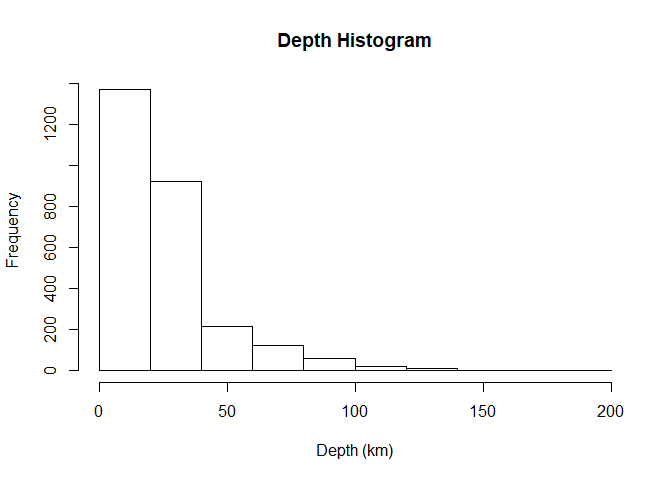<!-- -->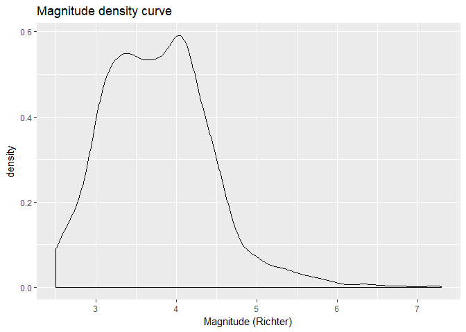<!-- -->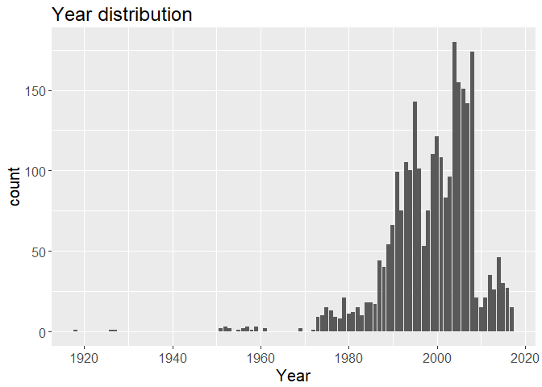<!-- -->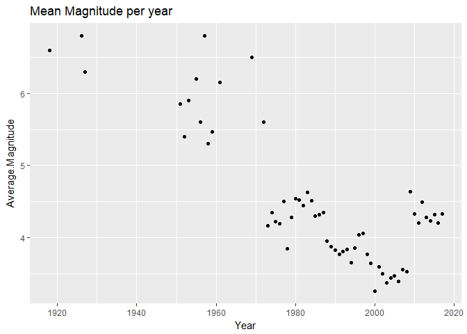<!-- -->

* This section can be easily broaden on the investigated variables as well as additional variables. 

## Data Preparation
Due to the lack of correlation between the magnitude and the other variables, new features are required in order to construct the mentioned models as well the target-feature which represents the binary output:  

1. Target-feature – Boolean variable - the forecasted year is labeled as 1 ("Yes“) if the maximum earthquake magnitude exceeds the median of maximum yearly magnitudes (threshold value) or 0 ("No“) if it is below the median.

Seismicity Indicators :

2. TimeDiff - Time elapsed over the last n events (in this project n=50).
3. Mean Magnitude – mean magnitude of the last n events.
4. dE1/2 -The rate of square root of seismic energy released over TimeDiff. Calculated by . The energy component is calculated by . If the release of seismic energy is disrupted for significantly long periods of time, the accumulated energy will be released abruptly in the form of a major seismic event when the stored energy reaches a threshold.
5. b coefficient – b value of the Gutenberg-Richter inverse power law.  
6. η value – The Mean Squared Error (MSE) of the regression line based on the Gutenberg-Richter inverse power law:.  is the number of events in the sliding window with magnitude Mi or greater. This is a measure of the conformance of the observed seismic data to the Gutenberg-Richter inverse power-law relationship.  
7. a/b coefficients - Difference between the largest observed magnitude and the largest expected magnitude based on the Gutenberg-Richter relationship.  


All of these indicators combine 50 earthquake events information (moving stats - similar to moving average by definition) which will be used in the construction of the models.  
In order to get better evaluated models it is essential first to check what is the distribution of the indicators:  


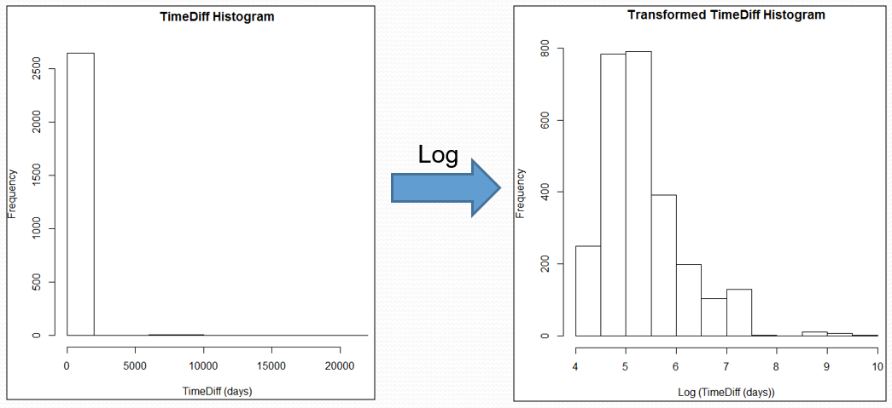 

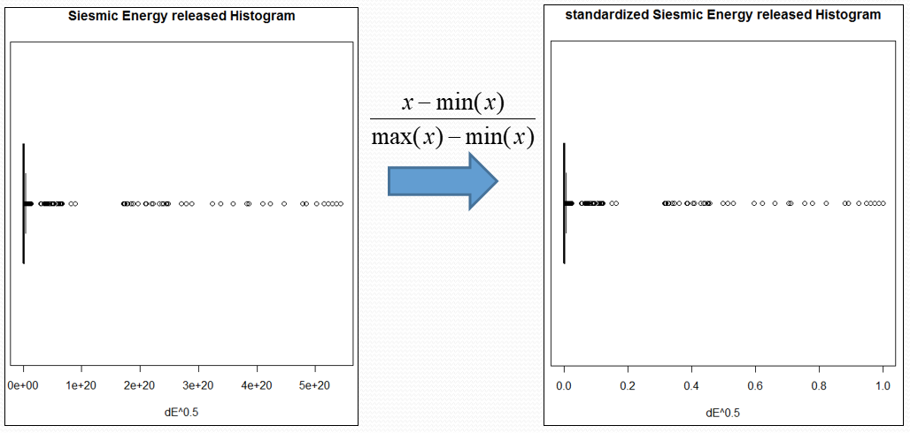 

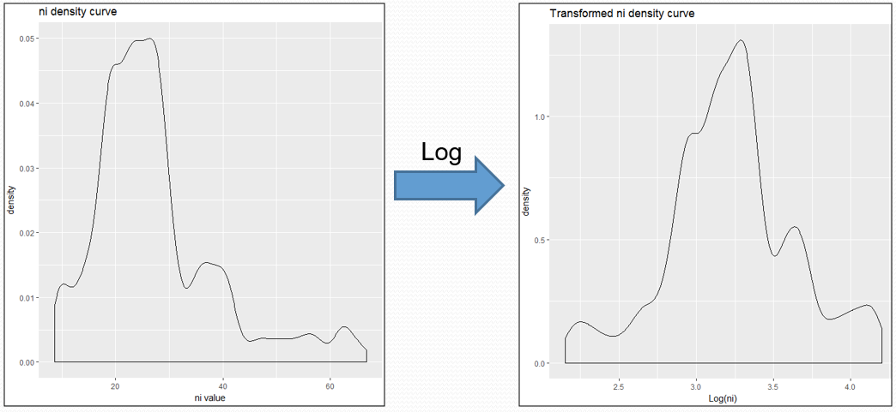 

 

Several features were transformed, according to the figures above:

* TimeDiff and η - log transformation due to right skewed data.  
* dE0.5 - data standardization to the range between 0-1 due to a very wide range of data.  
* ab.Ratio - cube root transformation due to left skewed data.  


## Modeling  
In this section the mentioned models (Decision tree, KNN, SVM, NNET) will be constructed and evaluated. The models will be based on a training-set which represents the first 2/3 complete observations while the remaining 1/3 will be used as test-set. The model evaluation will be first rely on accuracy values and eventually concluded based on calculated F-measures and ROC curves.  
  


For comparison purpose, the fraction of true target-feature (AboveMedian) values (value of "1") is 0.4674037.  
Below are the constructed models and their confusion matrices and accuracy:  

### Decision Tree

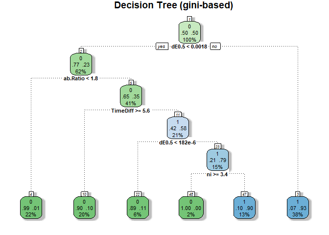<!-- -->

```
##    DT_predClass
##       0   1
##   0 441  73
##   1 146 215
```

The generated tree uses 4 out of the 6 indicators. The advantage of the decision tree is that the model selects the most discriminatory features which means that in this case the most contributing indicator is dE0.5 (released energy) since it serves as a first and secondary classifier. Another advantage of this model is its ease of interpretation. On the other hand this model is greedy and not necessarily represents the best fit to the data. The accuracy of this model is 0.7497143 which shows a moderate fit to the data.

### KNN  


```
##    knn_3
##       0   1
##   0 399 115
##   1 153 208
```

```
## [1] 0.6937143
```

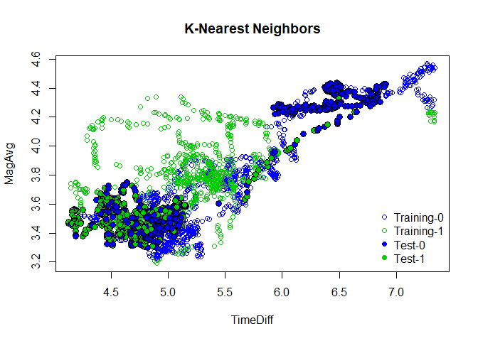<!-- -->


The shown KNN model present the scattering  of both training and test sets on the dimension (axes) of TimeDiff and average magnitude (MagAvg). The calculated accuracy of 0.6937143 show less fitting in relation to the decision tree. This kind of model is robust to noisy training data but also require selection of  K and attributes. In this case best KNN model found was with K=3 (achieved by trial and error).

### NNET  


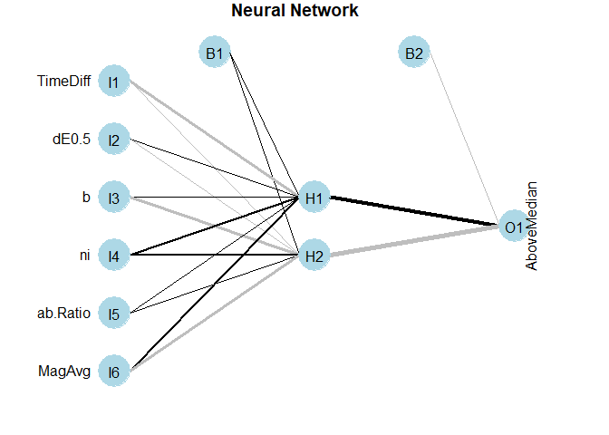<!-- -->

The constructed NNET model show two hidden nodes between the input and the output layers and was defined with a maximum number of iterations of 1000 and a decay value of 5e-1. These parameters found to be the optimal for this data-set. The accuracy value of the model is 0.6765714 which is also lower than the accuracy level of the decision tree. The adventage of the NNET model is its capability to do non-linear separation and that it is easy to synthesize.

### SVM  


```
##    SVM_Pred
##       0   1
##   0 410 104
##   1 227 134
```

```
## [1] 0.6217143
```

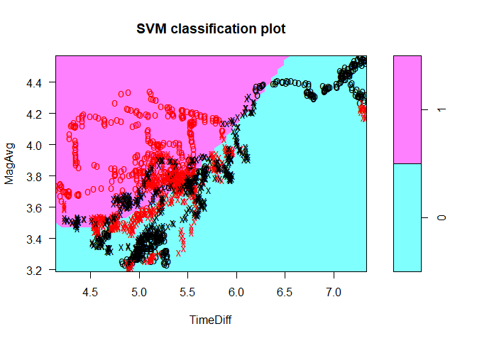<!-- -->

The figure above shows the SVM model in the same dimension as the KNN model (TimeDiff vs MagAvg) given the average value of all other indicators (dE0.5=0.0164983, b=-0.6761, η=3.225, ab.Ratio=1.791).  
The SVM model was constructed using radial basis function (which can be seen clearly on the model graph). The separation between the two classifications can be seen in the graph. Accuracy value of this model was found to be the lowest among the constructed models (0.6217143). The benefits using such model is the capability of the SVM to find non-linear separation in a highly dimensional space. On the other hand, such model is not intuitive to interpret because of its highly algorithmic complexity.  

## Evaluation Measures  

As mentioned at the begining of the modeling task, the constructed models will be also evaluated based on their calculated F-measure and ROC curve.  
The F-Measure Contains two basic parameters derived from the confusion matrix (Precision & Recall). Below is a table containing the F-measure values of each model. It is also clear from this table that the decision tree is more reliable (preferred) than the other models regarding this set of data.


```
##           Decision Tree       KNN      NNET       SVM
## F-Measure     0.6625578 0.6081871 0.5398374 0.4474124
```

Another evaluation measure is the ROC curve. The clear advantage of this measure in relation to the F-measure is its graphic visualisation which shows in a comprehensive way the differences between the evaluated models.  
Below are the generated ROC curves:  

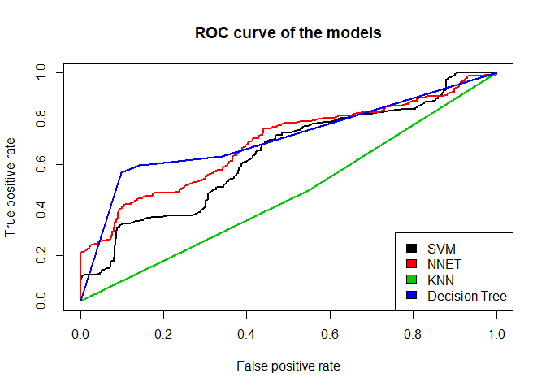<!-- -->

This graph shows the clear inferiority of the KNN model in relation to the other models (despite its relative high F-measure). Not only that, but this model also found to be worse than a total random model (described in the literature as the diagonal line connecting between 0,0 and 1,1 points). Also worth noting is the similarity between the other 3 models in the higher range of the false positive rate and their divergence in the lower range.  
Taking into account all evaluation measures, the conclusion regarding the best fitted model for the task in question is to use the decision tree model.  

## Implementation plan and further examination  

The implementation plan in the figure below describes in a basic way how the chosen model should fit into the corporation's system (considered as a general preliminary plan). The purpose of the model is to supply answer regarding the predicted value (in this case: yes/no output) which in turn dictate the response of the corporation to the tested situation (for example: the amount to be collected for force majeure insurance).

 

In conclusion, the purpose of this project was to supply basic model evaluation regarding earthquake data. The tested models show different functionality and qualities. In order to maximize the process of modeling and understanding, further examiniation is required such as:  

* Expand and elaborate data understanding.  
* Check other transformations.  
* Check models with more effective indicators (exclude indicators that has little contribution).  
* Improve models according to discovered patterns.  
* Check the significance of predictions.   
* Check additional models.  
* Check other configurations of implementations.  
* Apply model updating according to new data.  
* Combine additional models from related fields (Force majeure).  

## Reference  

Last M, Rabinowitz N, Leonard G (2016) Predicting the Maximum Earthquake Magnitude from Seismic Data in Israel and Its Neighboring Countries. PLoS ONE11(1): e0146101. https://doi.org/10.1371/journal.pone.0146101


